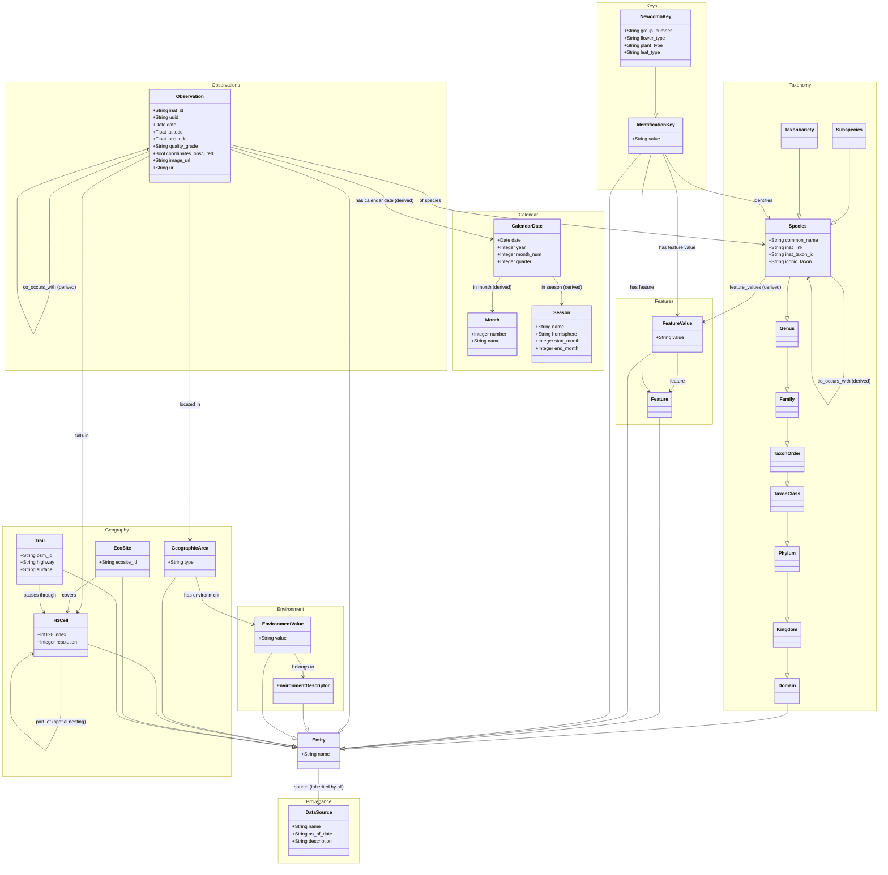

# Arborphy Ontology

Core concepts and relationships in the `arborphy_v2` RAI model.

## Full ontology

```mermaid
classDiagram
    %% ── Base ──────────────────────────────────────────────────────────────
    class Entity {
        +String name
    }

    %% ── Taxonomy ──────────────────────────────────────────────────────────
    namespace Taxonomy {
        class Domain
        class Kingdom
        class Phylum
        class TaxonClass
        class TaxonOrder
        class Family
        class Genus
        class Species {
            +String common_name
            +String inat_link
            +String inat_taxon_id
            +String iconic_taxon
        }
        class Subspecies
        class TaxonVariety
    }

    Domain --|> Entity
    Kingdom --|> Domain
    Phylum --|> Kingdom
    TaxonClass --|> Phylum
    TaxonOrder --|> TaxonClass
    Family --|> TaxonOrder
    Genus --|> Family
    Species --|> Genus
    Subspecies --|> Species
    TaxonVariety --|> Species

    %% ── Features ─────────────────────────────────────────────────────────
    namespace Features {
        class Feature
        class FeatureValue {
            +String value
        }
    }

    Feature --|> Entity
    FeatureValue --|> Entity

    %% ── Identification Keys ───────────────────────────────────────────────
    namespace Keys {
        class IdentificationKey {
            +String value
        }
        class NewcombKey {
            +String group_number
            +String flower_type
            +String plant_type
            +String leaf_type
        }
    }

    IdentificationKey --|> Entity
    NewcombKey --|> IdentificationKey

    %% ── Observations ─────────────────────────────────────────────────────
    namespace Observations {
        class Observation {
            +String inat_id
            +String uuid
            +Date date
            +Float latitude
            +Float longitude
            +String quality_grade
            +Bool coordinates_obscured
            +String image_url
            +String url
        }
    }

    Observation --|> Entity

    %% ── Geography ────────────────────────────────────────────────────────
    namespace Geography {
        class GeographicArea {
            +String type
        }
        class H3Cell {
            +Int128 index
            +Integer resolution
        }
        class EcoSite {
            +String ecosite_id
        }
        class Trail {
            +String osm_id
            +String highway
            +String surface
        }
    }

    GeographicArea --|> Entity
    H3Cell --|> Entity
    EcoSite --|> Entity
    Trail --|> Entity

    %% ── Environment ──────────────────────────────────────────────────────
    namespace Environment {
        class EnvironmentDescriptor
        class EnvironmentValue {
            +String value
        }
    }

    EnvironmentDescriptor --|> Entity
    EnvironmentValue --|> Entity

    %% ── Provenance ───────────────────────────────────────────────────────
    %% DataSource is identified by (name, as_of_date) — not an Entity subtype
    namespace Provenance {
        class DataSource {
            +String name
            +String as_of_date
            +String description
        }
    }

    %% ── Calendar ─────────────────────────────────────────────────────────
    namespace Calendar {
        class Month {
            +Integer number
            +String name
        }
        class Season {
            +String name
            +String hemisphere
            +Integer start_month
            +Integer end_month
        }
        class CalendarDate {
            +Date date
            +Integer year
            +Integer month_num
            +Integer quarter
        }
    }

    %% ── Relationships ────────────────────────────────────────────────────
    Entity --> DataSource : source (inherited by all)

    Species --> FeatureValue : feature_values (derived)
    Species --> Species : co_occurs_with (derived)

    FeatureValue --> Feature : feature
    IdentificationKey --> Species : identifies
    IdentificationKey --> Feature : has feature
    IdentificationKey --> FeatureValue : has feature value

    Observation --> Species : of species
    Observation --> GeographicArea : located in
    Observation --> H3Cell : falls in
    Observation --> Observation : co_occurs_with (derived)
    Observation --> CalendarDate : has calendar date (derived)

    H3Cell --> H3Cell : part_of (spatial nesting)
    EcoSite --> H3Cell : covers
    Trail --> H3Cell : passes through
    GeographicArea --> EnvironmentValue : has environment
    EnvironmentValue --> EnvironmentDescriptor : belongs to
    CalendarDate --> Month : in month (derived)
    CalendarDate --> Season : in season (derived)
```
